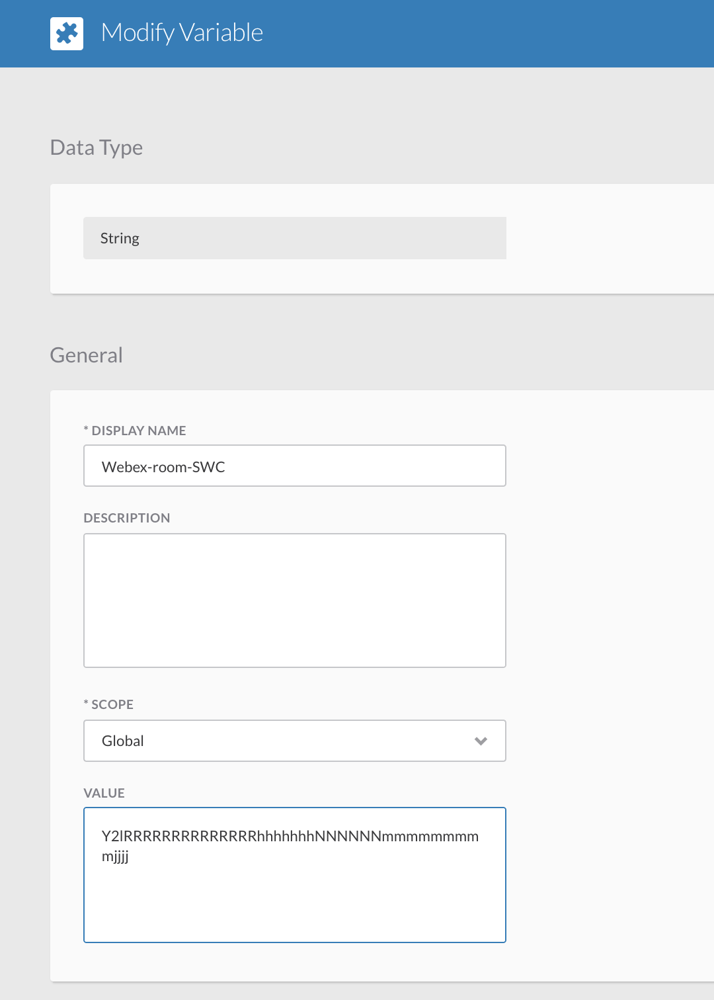
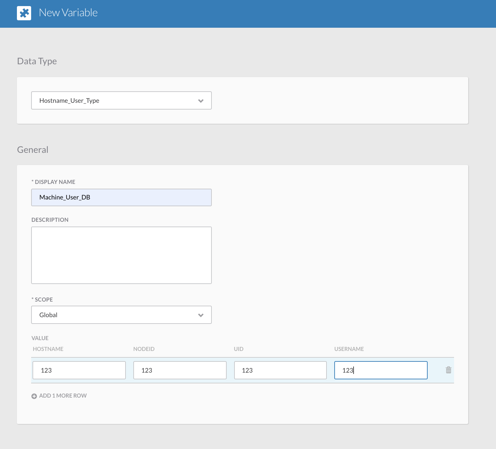

# NewLocalUser-Orbital

# Workflow Description: 
When triggered, this workflow will review machines and local users in Orbital and send a Webex alert on new user(s).

# Workflow Requirements: 
This workflow requires the Orbital_Credentials and Webex Teams Bot credentials. 
Please verify these settings prior to execution.

Please review these links:

  https://developer.webex.com/docs/bots#creating-a-webex-bot
  
  https://developer.webex.com/my-apps
  
  Based on these links You can create your own Webex Bot and Secure Webex Bot Account. 

  
  
  Please check the Webex Teams Room ID where you would like to send the alerts, like this way:
 
 
 

  After uploading the workflow, please review the database where workflow will store the machine and user info:
 
 
 

Please create or review a Generic Schedule like this as a trigger:

After a successful run, you will see the new user reported by the workflow:

